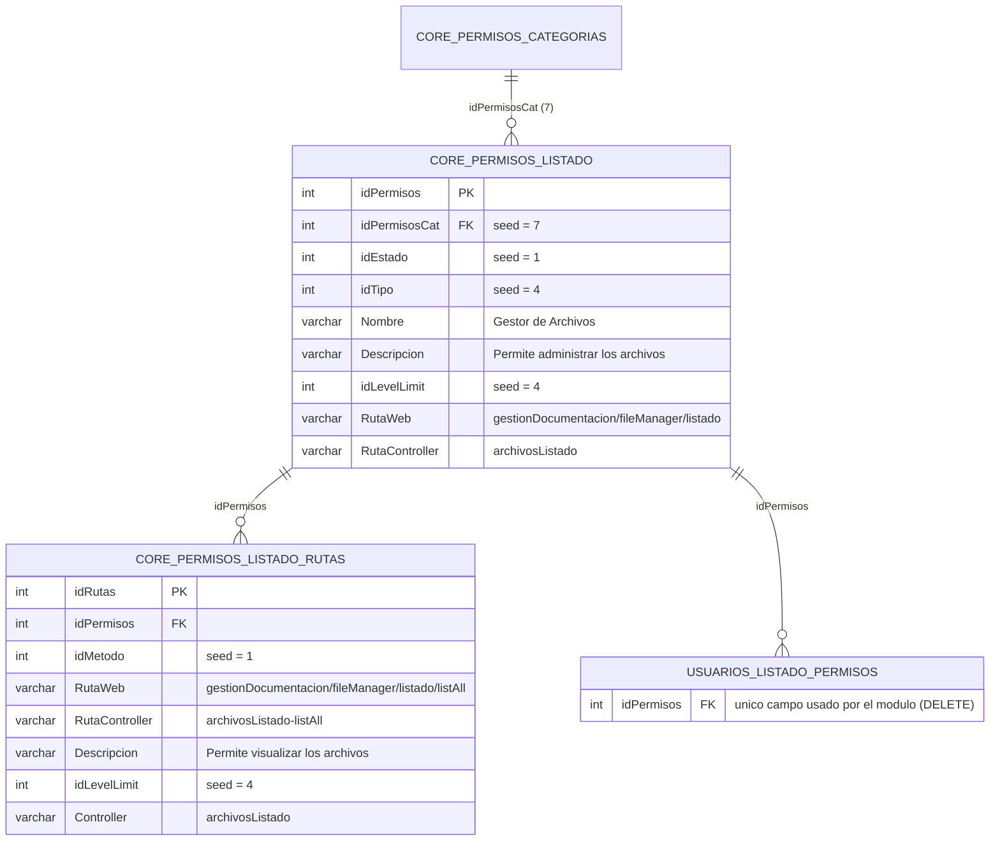

# Módulo `archivos` — Gestión de Documentación

> **Documentación técnica generada a partir del código fuente** (coreEngine — PHP + Fat-Free Framework, arquitectura MVC con controladores que extienden `ControllerBase`).
> Todas las afirmaciones citan archivo y línea. Los datos no deducibles del código se marcan como **⚠️ Pendiente por confirmar**.

---

## 1. Propósito y alcance

**Problema que resuelve:** ofrece dentro del panel de administración un **explorador/gestor de archivos web** para administrar los archivos y documentos del sistema, sin persistir el contenido en base de datos (el almacenamiento es en filesystem vía la librería `FileManager`).

| Dato | Valor | Fuente |
|---|---|---|
| Nombre del módulo (listado de instalación) | `Módulo de Gestión de Documentación` | `admin/app/modules/archivos/installer/archivosInstaller.php:45` |
| Descripción del módulo | `Módulo para gestionar los archivos y documentos` | `admin/app/modules/archivos/installer/archivosInstaller.php:46` |
| **Nombre en el menú** | `Gestor de Archivos` — *Descripción:* `Permite administrar los archivos` | `admin/app/modules/archivos/installer/archivosInstaller.php:72-73` |
| Ruta de menú (`RutaWeb`) | `gestionDocumentacion/fileManager/listado` | `admin/app/modules/archivos/installer/archivosInstaller.php:75` |
| Título de la página (vista) | `Explorador Archivos` | `admin/app/modules/archivos/controller/archivosListado.php:37-38` |

**Alcance real:** el controlador del módulo **solo expone una vista** (`listAll`, `archivosListado.php:32`). Las operaciones de datos sobre archivos (listar, subir, crear carpeta, borrar archivo/carpeta) **no viven en este módulo**, sino en endpoints *core* reutilizables (`/core/fileExplorer/*`, registrados en `admin/app/utils/sistemaFuncionalidad.php:5-9`, implementados por `sistemaFuncionalidad` en `admin/app/modules/root_plataforma/controller/sistemaFuncionalidad.php:32-200`) que delegan en la librería `FileManager` (`vendors/application/storage`).

**Relación con otros módulos del sistema:**

- **`root_plataforma`** → aporta el controlador `sistemaFuncionalidad` que implementa los endpoints del widget (`FileExplorer_updateView`, `FileExplorer_createFolder`, `FileExplorer_uploadFile`, `FileExplorer_delFolder`, `FileExplorer_delFile`; `admin/app/modules/root_plataforma/controller/sistemaFuncionalidad.php:32,58,82,143,167`).
- **`root_maquetacion`** → existe una vista de demo/referencia del mismo widget (`admin/app/modules/root_maquetacion/views/coreWidgets-fileExplorer.php`): el widget es compartido entre módulos.
- **Núcleo de permisos** → se integra al menú y a la seguridad mediante las tablas `core_permisos_listado`, `core_permisos_listado_rutas` y `usuarios_listado_permisos` (secciones 4 y 6).

---


## 2. Estructura de archivos

Árbol real del módulo (`find admin/app/modules/archivos -type f`):

```text
admin/app/modules/archivos/
├── .htaccess                      # Deniega todo acceso HTTP directo a la carpeta
├── README.md                      # Este documento (antes vacío)
├── controller/
│   ├── .htaccess                  # Deniega acceso directo
│   └── archivosListado.php        # Controlador principal: vista listAll del explorador
├── installer/
│   ├── .htaccess                  # Deniega acceso directo
│   └── archivosInstaller.php      # Instala/desinstala los permisos y rutas de menú del módulo
├── testing/
│   ├── .htaccess                  # Deniega acceso directo
│   └── archivosTesting.php        # Suite de pruebas (9 métodos públicos *Test)
└── views/
    ├── .htaccess                  # Deniega acceso directo
    └── archivosListado-List.php   # Vista del listado: invoca el widget fileExplorer
```

Responsabilidades:

| Archivo | Responsabilidad |
|---|---|
| `controller/archivosListado.php` | Clase `archivosListado extends ControllerBase` (`:5`). Prepara `$f3->data` (título, datos de usuario, nivel de acceso, instancia del widget) y renderiza la vista `archivosListado-List.php` (`:32-52`). |
| `views/archivosListado-List.php` | Vista sin lógica de datos: arma `$Options` y llama a `$data['Fnc_WidgetsCommon']->widget_fileExplorer($Options)` (`:12-19`). |
| `installer/archivosInstaller.php` | Clase `archivosInstaller extends ControllerBase` (`:5`). Expone `ListDataModule`, `InstallModule`, `UninstallModule`, `GetCountDataModule`, `listRouteModule` y el helper privado `RutaController`. |
| `testing/archivosTesting.php` | Clase `archivosTesting extends ControllerBase` (`:25`) con 9 métodos públicos de prueba (convención `*Test`, descubiertos por `sistemaTesteos::discoverTests()`) sobre estructura del módulo, controlador/vista, permisos de sesión, seguridad de rutas, validación de subida, ciclo de carpetas y autorización por ámbito. Detalle en la sección 9.2. |
| `.htaccess` (todas las carpetas) | Contenido idéntico en los 5 archivos: `<Files .htaccess>` con `Order allow,deny / Deny from all` y una directiva final `deny from all` — bloquea el acceso directo por HTTP al contenido del módulo. |

> **Nota:** el módulo **no posee carpeta `widgets/`** ni `models/`. El widget del explorador lo aporta la capa común `vendors/application/functions/UIWidgetsCommon.php` (ver sección 8).

---
## 3. Controladores y acciones

### 3.1 `archivosListado` (controlador del módulo)

`admin/app/modules/archivos/controller/archivosListado.php`

- **Constructor** (`:15-24`): crea la conexión `Database::getSQLConnection(ConfigDataBase::MySQL_1)` (`:17`), un `QueryBuilder` y un `CheckData` (`:18-19`), fija `$this->controllerName = 'archivosListado'` (`:21`) y llama a `parent::__construct($DB_conn_1, $queryBuilder, $checkData)` (`:23`).
- **Métodos públicos:** únicamente `listAll($f3)`. **No existen métodos de datos** (`Insert`, `Update`, `Delete`, `delFiles`, …) en este controlador.

| Método | Clasificación | Verbo HTTP esperado | Parámetros de entrada | Respuesta |
|---|---|---|---|---|
| `listAll($f3)` | **VISTA** | GET (implícito: la ruta de menú se registra con `idMetodo = 1` en `archivosInstaller.php:267`) | Ninguno por request; toma datos de sesión (`SESSION.DataInfo`, `SESSION.arrLevel`) vía `getUserData()`/`getArrLevel()` (`:42-43`) | HTML completo: `showVista(1, …)` renderiza `user-header.php` + `archivosListado-List.php` + `user-footer.php` (`:50`; comportamiento del caso 1 en `vendors/application/controller/ControllerBase.php:1195-1217`) |

Detalle de `$f3->data` que construye (`archivosListado.php:35-46`):

```php
'PageTitle'          => 'Explorador Archivos',
'PageDescription'    => 'Explorador Archivos',
'PageAuthor'         => ConfigAPP::SOFTWARE['SoftwareName'],
'PageKeywords'       => ConfigAPP::SOFTWARE['SoftwareName'],
'UserData'           => $this->getUserData($f3),                        // sesión DataInfo
'UserAccess'         => $this->getArrLevel($f3, $this->controllerName), // sesión arrLevel
'Fnc_WidgetsCommon'  => new UIWidgetsCommon(),                          // widget del explorador
```

La ruta de la vista se resuelve con `returnRutaVista(__DIR__, 'app')` + `/archivosListado-List.php` (`:50`; helper en `ControllerBase.php:958`).

### 3.2 Acciones de datos del explorador (fuera del módulo, pero son su "motor")

Las acciones de datos que el usuario dispara desde la vista del módulo están implementadas en el controlador **core** `sistemaFuncionalidad` (ver también la sección 11):

| Método del controlador core | Acción | Verbo validado | Entrada | Respuesta |
|---|---|---|---|---|
| `FileExplorer_updateView` (`root_plataforma/.../sistemaFuncionalidad.php:32`) | Listar carpeta | GET (ruta en `admin/app/utils/sistemaFuncionalidad.php:5`) | Parámetros de ruta `@route` (cifrado), `@tipos`, `@path` | `Response::direct($files)` si es array; si no, `showError(2, …)` (`:46-53`) |
| `FileExplorer_createFolder` (`:58`) | Crear carpeta | POST obligatorio; si no, `Response::error(…, 405)` (`:61-64`) | `$_POST` | `Response::fileData(success, message)` (`:73`) |
| `FileExplorer_uploadFile` (`:82`) | Subir archivo | POST obligatorio 405 (`:85-88`); exige `$_FILES['file']` (`:91-94`) | `$_FILES['file']`, `$_POST['SubRoute']`, `$_POST['path']` | `Response::fileData(…)` (`:136`) |
| `FileExplorer_delFolder` (`:143`) | Borrar carpeta | POST obligatorio 405 (`:146-149`) | `$_POST` | `Response::fileData(…)` (`:157`) |
| `FileExplorer_delFile` (`:167`) | Borrar archivo | POST obligatorio 405 (`:170-173`) | `$_POST['name']`, `$_POST['SubRoute']`, `$_POST['path']` | `Response::fileData(…)` (`:196`) |

---

## 4. Modelo de datos

**El módulo no tiene tablas propias.** `listAll()` no ejecuta ninguna query contra la BD (solo lee sesión), por lo que la conexión `MySQL_1` instanciada en el constructor queda sin uso (`archivosListado.php:17`).

Las únicas tablas que el módulo toca son las **tablas de permisos del core**, y solo desde el *installer*:

| Tabla | Operación | Campos usados | Fuente |
|---|---|---|---|
| `core_permisos_listado` | INSERT (install), SELECT (uninstall), DELETE (uninstall) | `idPermisosCat, idEstado, idTipo, Nombre, Descripcion, idLevelLimit, RutaWeb, RutaController`; se lee también `idPermisos` | `archivosInstaller.php:94-99, 104, 174-184, 201` |
| `core_permisos_listado_rutas` | INSERT (install), COUNT (detección), DELETE (uninstall) | `idPermisos, idMetodo, RutaWeb, RutaController, Descripcion, idLevelLimit, Controller`; se lee `idRutas` para el conteo | `archivosInstaller.php:124-129, 133, 232-241, 202` |
| `usuarios_listado_permisos` | DELETE (uninstall, en cascada) | `idPermisos` | `archivosInstaller.php:200` |

**Valores sembrados (seed) por el installer:**

| Campo | Valor permiso | Valor ruta | Fuente |
|---|---|---|---|
| `idPermisosCat` | `7` | — | `archivosInstaller.php:69` |
| `idEstado` | `1` | — | `:70` |
| `idTipo` | `4` | — | `:71` |
| `Nombre` | `Gestor de Archivos` | — | `:72` |
| `Descripcion` | `Permite administrar los archivos` | `Permite visualizar los archivos` | `:73` / `:267` |
| `idLevelLimit` | `4` | `4` | `:74` / `:267` |
| `RutaWeb` | `gestionDocumentacion/fileManager/listado` | `gestionDocumentacion/fileManager/listado/listAll` | `:75` / `:267` |
| `RutaController` | `archivosListado` | `archivosListado->listAll` | `:76` / `:267` |
| `idMetodo` | — | `1` | `:267` |
| `Controller` | — | `archivosListado` | `:267` |

**Catálogos del core (valores resueltos, verificados contra la BD de administración `MySQL_ADMIN` mediante consultas de solo lectura y el JOIN de `permisosListado`, `root_plataforma/.../permisosListado.php:55-70`):**

| Campo | Valor del seed | Significado real (catálogo) | Fuente del catálogo |
|---|---|---|---|
| `idPermisosCat = 7` | Categoría de menú | **`Gestión Documentación`** | Tabla `core_permisos_categorias` (fila 7); JOIN en `permisosListado.php:59` |
| `idEstado = 1` | Estado | **`Activo`** | Tabla `core_estados` (fila 1); JOIN en `permisosListado.php:60` |
| `idTipo = 4` | Tipo de permiso | **`Otros`** (en el generador de rutas del core, `case 4` = "Otros" y no autogenera rutas: el módulo define las suyas) | Tabla `core_permisos_listado_tipo` (fila 4); `permisosListado.php:888, 1286-1288` |
| `idLevelLimit = 4` | Nivel requerido | **`Ver / Editar / Crear / Borrar`** (`NombreCorto: view / edit / create / del`) | Tabla `core_permisos_listado_level_limit` (fila 4); JOIN en `permisosListado.php:63` |
| `idMetodo = 1` | Método HTTP de la ruta | **`GET`** (catálogo completo: `1=GET`, `2=POST`, `3=DELETE`, `4=PUT`) | Tabla `core_permisos_listado_rutas_metodo`; JOIN en `PermissionService.php:124-130` |

**Estado real en BD (verificado):** el seed ya existe — `core_permisos_listado` fila `idPermisos = 33` (categoría 7, tipo 4, "Gestor de Archivos") y `core_permisos_listado_rutas` fila `idRutas = 524` (ruta `…/listAll`, método GET, ligada al permiso 33). ⚠️ **Consecuencia actualizada:** gracias al `unique` añadido en el installer (`:100, 134`), re-ejecutar `InstallModule()` ya no duplica: `Base_insert` falla la validación de unicidad y la transacción se revierte (el módulo permanece con sus filas originales).

> ✅ **Resuelto:** el significado de `idPermisosCat = 7`, `idTipo = 4`, `idEstado`, `idLevelLimit` e `idMetodo` está documentado en la tabla de catálogos de arriba (verificado contra BD y contra el generador de rutas del core).

**Almacenamiento de archivos:** los documentos **no se registran en ninguna tabla** del módulo. El listado/subida/borrado opera sobre el filesystem a través de `FileManager` (invocado en `root_plataforma/.../sistemaFuncionalidad.php:35-36, 68, 125, 152, 180-184`). La librería de storage (`vendors/application/storage/README.md:161-167`) expone `validateFiles`, `uploadFile`, `deleteFile`, `deleteFilesMassive`, `fileExplorer`, `createFolder`, etc., con drivers Local/S3/GCS/SFTP. ⚠️ La carpeta raíz concreta que explora el widget se toma de `UserData['MainPathUrl']` en la vista (`archivosListado-List.php:14`); su valor exacto depende de la sesión del usuario.

### Diagrama entidad-relación (Mermaid)



> Relación `CORE_PERMISOS_CATEGORIAS` inferida del nombre del campo `idPermisosCat`; el módulo no define la FK explícitamente (las tablas se crean en el installer del core, no en este módulo). Los otros vínculos sí se evidencian en el código: `listRouteModule($Type, $permisosID)` inserta rutas con el `idPermisos` recién creado (`archivosInstaller.php:115-133`) y el desinstalador borra por `idPermisos` en cascada (`:200-202`).

---

## 5. Reglas de negocio y validaciones

### 5.1 `dataCheck()` — configuración

**Actualizado:** el controlador de vista (`archivosListado.php`) y el testing (`archivosTesting.php`) no definen `dataCheck()` (no aplican: no insertan datos), pero **el installer sí define dos configuraciones de `CheckData`**:

- **`dataCheck_1($POST)` — para el INSERT del permiso** (`archivosInstaller.php:336-370`):

| Regla | Campos | Parámetro |
|---|---|---|
| `emptyData` (presencia) | — (vacío; la obligatoriedad la cubre `'required'` del QueryBuilder) | — |
| `ValidarNumero` / `ValidarEntero` | `idPermisosCat, idEstado, idTipo, idLevelLimit` | — |
| `ValidarLargoMinimo` | `Nombre, Descripcion` | `ValidarLargoMinimoN = 3` (`:350`) |
| `ValidarLargoMaximo` | `Nombre` | `ValidarLargoMaximoN = 255` (`:352`) |
| `ValidarPalabrasCensuradas` | `Nombre, Descripcion` | — |
| `encode` | — (vacío; el cifrado lo maneja `'encode'` del QueryBuilder, `:101`) | — |

- **`dataCheck_2($POST)` — para los INSERT de rutas** (`archivosInstaller.php:375-409`):

| Regla | Campos | Parámetro |
|---|---|---|
| `ValidarNumero` / `ValidarEntero` | `idPermisos, idMetodo, idLevelLimit` | — |
| `ValidarLargoMinimo` | `Descripcion` | `ValidarLargoMinimoN = 3` (`:389`) |
| `ValidarPalabrasCensuradas` | `Descripcion` | — |

Flujo de ejecución (`Base_insert`, `ControllerBase.php:261-281`):

1. `$this->checkData->checkingData($DataCheck)` corre **siempre** que `DataCheck` no esté vacío; si falla, no llega al QueryBuilder (`ControllerBase.php:273-276`).
2. Dentro de `checkingData`, las reglas de formato **se omiten si el campo no existe o va vacío** en el `Post` (`vendors/application/models/CheckData.php:166-167`) — la presencia la garantiza `'required'` (paso 2 en `QueryBuilder::queryInsert`, `:402-406`).
3. Luego el QueryBuilder valida `required` (`:99`/`:133`), `unique` (`:100`/`:134`) y `encode` (`:101`/`:135`) — ver sección 9.1 (installer). El flag `'novalidate' => true` que envía el INSERT de rutas (`archivosInstaller.php:140`) **no** exime de `required`/`unique`: solo omite el `trim()` del valor al bindear (`QueryBuilder.php:441`), porque las validaciones corren antes (`:403-411`).

**✅ Bug histórico (deuda #14) — RESUELTA:** en versiones previas el INSERT de rutas construía `$dataCheck_2 = $this->dataCheck_2($_POST)` (`archivosInstaller.php:127`) en lugar de `$this->dataCheck_2($rutas)` (así como el permiso usa `dataCheck_1($permiso)`, `:93`). Como en la instalación programática `$_POST` está vacío, `checkingData()` no encontraba campos que validar y devolvía `status = true`, de modo que el chequeo declarado era un **no-op** y las reglas de `CheckData` (enteros, largo mínimo, palabras censuradas) no se aplicaban a las rutas. **Actualizado:** la línea `:127` ahora pasa el array real de la ruta (`dataCheck_2($rutas)`), por lo que el chequeo se ejecuta sobre los datos efectivos (`idPermisos`, `idMetodo`, `idLevelLimit`, `Descripcion`, …) definidos en `listRouteModule()` (`:304`). **Verificado:** los valores sembrados superan las reglas — ids numéricos (`idPermisos`, `idMetodo=1`, `idLevelLimit=4`), `Descripcion` de 31 caracteres (> 3) y sin palabras de la lista negra (`FunctionsDataText::contarPalabrasCensuradas`, `FunctionsDataText.php:352-372`) —, por lo que el chequeo ya opera sin bloquear la instalación. El flujo queda confirmado: `Base_insert()` invoca siempre `checkingData()` (`ControllerBase.php:273-276`) y éste toma los datos de `$config['Post']` (`CheckData.php:115`), que ahora recibe el array real de la ruta.

**Mitigación (verificada):** el `'required'` (`:133`) y el `'unique'` (`:134`) del QueryBuilder **sí** se ejecutan — el `'novalidate' => true` de `:140` solo omite el `trim()` (`QueryBuilder.php:441`) —, de modo que el install no se rompe. El riesgo real es que las reglas de `CheckData` (enteros, largo mínimo, palabras censuradas) **no se aplican** a los datos de las rutas, y que una invocación futura desde un request con `POST` ajeno validaría datos equivocados.

### 5.2 Manejo de archivos (backend del widget)

| Regla | Valor | Fuente |
|---|---|---|
| Tipos MIME/categorías permitidos en subida | `word,excel,powerpoint,pdf,image,txt,zip,video,music` | `root_plataforma/.../sistemaFuncionalidad.php:106` |
| Peso máximo (`ValidarPeso`) | `10` (MB, según convención de la librería) | `:107` |
| Codificación Base64 | `Base64 => false` (subida binaria normal) | `:108` |
| Sanitización de rutas | `sanitizePath()` sobre `SubRoute` y `path` (anti path-traversal, recorta `/`) | `:97-100, 174-176` |
| Método HTTP | POST estricto en create/upload/delete (405 en caso contrario) | `:61-64, 85-88, 146-149, 170-173` |
| Validación previa a subida | `$FileManager->validateFiles($_FILES, $query['files'])` antes de `uploadFile()` | `:116-126` |
| Filtro de visualización (JS) | `ValidarTipo` vacío en la vista → el widget usa `'all'` (muestra todos los tipos permitidos por sus exclusiones) | `archivosListado-List.php:16` + `UIWidgetsCommon.php:1638` |

> ✅ **Resuelto:** la unidad de `ValidarPeso = 10` son **MB**. `FileManager::validateFiles()` compara `$_FILES[...]['size'] >= (ValidarPeso * 1048576)` bytes (`vendors/application/models/FileManager.php:332`); el mismo criterio aplica a subidas Base64 con factor 1.37 (`:720`).

### 5.3 Transacciones

- **`InstallModule()` usa transacción**: `Base_transactionBegin()` (`archivosInstaller.php:84`) → `dataCheck_1($permiso)` (`:93`) → INSERT del permiso en `core_permisos_listado` (`:108`) → INSERTs de rutas en `core_permisos_listado_rutas` (`:141`) → `Base_transactionCommit()` (`:159`). Ante cualquier fallo: `Base_transactionRollback()` + `Response::error('Error al operar con la Base de Datos', 500, $error)` (`:111-116` permisos y `:144-149` rutas).
- **`UninstallModule()` también usa transacción**: `Base_transactionBegin()` (`:185`) → consulta de permisos → guarda de resultado **corregida** (`:210-212`, ahora chequea `'status'`, ver deuda #13 RESUELTA) → 3 `DELETE` con `Base_queryExecute()` (`:224-226`, `:237`) → `Base_transactionCommit()` (`:250`). Si un `DELETE` falla: `Base_transactionRollback()` + `return false` (`:241-244`).

### 5.4 Borrado en cascada de tablas relacionadas (desinstalación)

Flujo de `UninstallModule()` (`archivosInstaller.php:171-256`):

1. Validación temprana: si `RutaController()` llega vacío → `return false` (`:179-181`).
2. Apertura de transacción (`:185`).
3. `SELECT idPermisos FROM core_permisos_listado WHERE RutaController IN ("archivosListado")` con `Base_GetList()` (`:192-206`).
4. Guarda de resultado (`:210-212`): si la consulta falla o no hay filas → `return false` (nada que borrar). ✅ **Corregida**: ahora valida `$arrPermisos['status']` (antes chequeaba `'success'`, clave inexistente — bug #13 resuelto).
5. `subQuery` con los `idPermisos` encontrados usando `$arrPermisos['status']` (`:217-219`).
6. Tres `DELETE` en cascada, cada uno verificado con rollback ante fallo (`:223-244`):
   - `DELETE FROM usuarios_listado_permisos WHERE idPermisos IN (0 …)` (`:224`).
   - `DELETE FROM core_permisos_listado WHERE RutaController IN ("archivosListado")` (`:225`).
   - `DELETE FROM core_permisos_listado_rutas WHERE Controller IN ("archivosListado")` (`:226`).
7. `Base_transactionCommit()` (`:250`).

El `0` inicial en el `IN` (`:224`) evita la lista vacía si no hay permisos previos (subQuery vacío, `:217-219`).


---

## 6. Permisos y seguridad

### 6.1 Cadena de permisos

1. **Siembra:** el installer registra el permiso con `idLevelLimit = 4` y su ruta con `idMetodo = 1` / `idLevelLimit = 4` (`archivosInstaller.php:74, 267`).
2. **Carga en sesión:** `PermissionService::getLevels()` construye `SESSION.arrLevel` mapeando por controlador: `arrLevel[PermisosController]['LevelAccess'] = PermisosLevel` y `['RouteAccess'] = RutaWeb`; el superadministrador (`TipoUsuarioID == 1`) recibe además rutas fijas de prueba con nivel 4 (`admin/app/helpers/PermissionService.php:171-198`).
3. **Lectura en el módulo:** `listAll()` llama a `getArrLevel($f3, 'archivosListado')`, que devuelve `SESSION.arrLevel['archivosListado']` (o `[]` si no existe) (`archivosListado.php:43`; `vendors/application/controller/ControllerBase.php:99-119`).
4. **Consumo en la vista:** la vista pasa `$data['UserAccess']['LevelAccess']` al widget como `levelPermission` (`archivosListado-List.php:17`).
5. **Efecto en la UI:** según la semántica documentada del widget — `1` solo ver, `2` subir archivos, `3` borrar archivos (`UIWidgetsCommon.php:1618`):
   - `levelPermission >= 2` → muestra botones *Subir Archivo* y *Crear Carpeta* + input de archivo oculto (`UIWidgetsCommon.php:1652-1659`).
   - `levelPermission >= 3` → muestra la columna *Acciones* en la vista de lista (`:1687`).
   - Valor por defecto si llega vacío: `4` (todo habilitado) (`:1639`).

### 6.2 `UserData`

`getUserData($f3)` devuelve `SESSION.DataInfo` (array) o `[]` como fallback seguro (`ControllerBase.php:54-70`). En este módulo se usa para `'UserData' => $this->getUserData($f3)` (`archivosListado.php:42`) y, dentro de la vista, `UserData['MainPathUrl']` se pasa al widget como `rootPath` (raíz que explorará) (`archivosListado-List.php:14`).

### 6.3 Cifrado de IDs con `encryptDecrypt()`

- Firma: `encryptDecrypt($action, $string, $passkey = '') : array` (`vendors/application/functions/FunctionsSecurityCodification.php:173`).
- El widget cifra la ruta/subruta antes de exponerla al cliente: `$RouteID = $fnc_Codification->encryptDecrypt('encrypt', $SubRoute); $Route = $RouteID['data']` (`UIWidgetsCommon.php:1632-1637`). En este módulo `Route` llega vacío (`archivosListado-List.php:15`), por lo que el valor cifrado corresponde a cadena vacía.
- La ruta cifrada viaja en la URL AJAX del listado (`/core/fileExplorer/updateList/{Route}/{ValidarTipo}/{path}`, `UIWidgetsCommon.php:1904`).

### 6.4 Otros controles de seguridad

| Control | Detalle | Fuente |
|---|---|---|
| Denegación de acceso directo | 5 archivos `.htaccess` con `deny from all` (raíz + controller + installer + testing + views) | árbol en sección 2 |
| Verificación de método HTTP | POST estricto (405) en create/upload/delete | `sistemaFuncionalidad.php:61-64, 85-88, 146-149, 170-173` |
| Anti path-traversal | `sanitizePath()` server-side sobre `SubRoute`/`path` | `sistemaFuncionalidad.php:97-100, 174-176` |
| **Autorización por ámbito (scope)** | Los endpoints `/core/fileExplorer/*` son **genéricos** y los comparten varios módulos, por lo que no pueden conocer el módulo invocador. El módulo que implementa la pantalla **concede** el nivel en la sesión (`ScopeAccess::grant()`) al renderizar la vista, y el endpoint **lo valida** (`ScopeAccess::check()`) exigiendo un mínimo por operación: `updateList`=1, `createFolder`/`uploadFile`=2, `delFolder`/`delFile`=3. El nivel **no viaja por el cliente**: el parámetro `AccessScope` solo *selecciona* una concesión ya existente y no puede crearla ni elevarla. La concesión se ata al `UserID` de sesión, caduca a los 15 min y los intentos denegados se registran en `AuditLogger` como `AUTHZ` | `ScopeAccess.php`, `sistemaFuncionalidad.php:27-82, 95, 130, 159, 225, 254`, `archivosListado.php:30-36`, `coreWidgets.php:281-286`, `UIWidgetsCommon.php:1672-1681` |
| Bloqueo de borrado masivo de subrutas | `deleteFolder()` valida el nombre **ya sanitizado** antes de ensamblar la ruta: si `sanitizeFolderName()` lo reduce a cadena vacía (`..`, `.`, `!!!`) la operación se rechaza con `Nombre de carpeta inválido` (sin subruta: `No se permite eliminar la carpeta raíz`). La ruta final siempre es `SubRoute/path/<nombre explícito>`, nunca una subruta colapsada. La guarda de `createFolder()` aplica el mismo criterio | `FileManager.php:538-574, 596-645` |
| Codificación URL en nombres | `sanitizeFolderName()` aplica `rawurldecode()` antes del filtro (igual que `sanitizePath()`), de modo que `%2e%2e` se normaliza a `..` y se descarta en lugar de convertirse en el nombre válido `2e2e` | `FileManager.php:690-698` |
| Defensa en profundidad en el driver | `deleteDirectory()` de los 4 drivers (Local/S3/GCS/SFTP) rechaza una ruta vacía o solo con barras: en Local borraría la carpeta base de `upload/` y en S3/GCS el bucket completo | `LocalStorageDriver.php:128-139`, `S3StorageDriver.php:239-249`, `GCSStorageDriver.php:210-220`, `SFTPStorageDriver.php:171-181` |
| Filtros de contenido (JS del widget) | `EXCLUDED_NAMES` (`.htaccess`, `.env`, `config.php`, `README.md`, `error_log`, …), `EXCLUDED_EXTENSIONS` (`php`, `phtml`, `ini`, `sh`, `exe`, `sql`, …), `EXCLUDED_FOLDERS` (`.git`, `vendor`, `node_modules`, `logs`, `backup`, …) y `sanitizePath()` JS que elimina `..` | `UIWidgetsCommon.php:1769-1800` |
| Filtros de contenido (server-side, subida) | `validateFiles()` y `saveFileViaDriver()` rechazan `EXCLUDED_NAMES` (`.htaccess`, `.env`, `config.php`, …), cualquier nombre que comience por `.` (archivos ocultos) y las extensiones de `BLOCKED_EXTENSIONS` (incl. `htaccess`/`htpasswd`) | `FileManager.php:319-323, 858-865, 1057-1071` |
| Extensión derivada del MIME (subida) | Multipart (`handleNormalUpload`): valida el MIME real contra la lista blanca por categoría y **reemplaza la extensión enviada por el cliente** por la derivada del MIME (`resolveExtensionFromMime`), igual que el flujo Base64; neutraliza variantes no listadas en la lista negra (`pht`, `php7`, `phps`, `shtml`, …) | `FileManager.php:801-825, 914-947, 1364-1368` |
| Respuesta de error estándar | `Response::error('Error al operar con la Base de Datos', 500, $error)` en fallos de instalación | `archivosInstaller.php:111, 140` |

> ✅ **Resuelto — el gate global existe y está demostrado en el bootstrap** `admin/public/index.php`:
> 1. Al arrancar se valida la sesión contra la BD con `SessionService::check()/validate()` usando la cookie `Sesion_tk` (`admin/public/index.php:77-89`).
> 2. **Las rutas del widget `/core/fileExplorer/*` solo se registran si `$UserSesion === true`**: `sistemaFuncionalidad.php` se incluye dentro de ese bloque (`admin/public/index.php:95-100`). Sin sesión válida, esas rutas no existen para Fat-Free.
> 3. Las rutas de módulos (como `gestionDocumentacion/fileManager/listado/listAll`) se registran **dinámicamente desde `SESSION.arrPermisos`**, solo para el usuario autenticado (`admin/app/utils/userData.php:29-37`).
> 4. Además se aplica un *rate limiter* por usuario/IP (HTTP 429 al exceder el límite) y el manejo seguro de errores está activo (`admin/public/index.php:29-33, 102-118`; `ErrorHandler.php`, `RateLimiter.php`).
> **Resuelto — la granularidad por nivel ya se valida en el backend:**
> 1. Antes los endpoints `/core/fileExplorer/*` solo exigían sesión: cualquier usuario autenticado podía crear/subir/borrar en todo el almacenamiento aunque el módulo no estuviera entre sus permisos.
> 2. Ahora cada módulo que implementa una pantalla del explorador **concede** su nivel en sesión al renderizar (`ScopeAccess::grant()`) y cada endpoint **valida** el mínimo de su operación (`ScopeAccess::check()`, fail-closed). Ver la fila "Autorización por ámbito" en la tabla 6.4.
> 3. Cobertura de regresión: `autorizacionScopeTest()` (15 casos) valida normalización, umbrales por nivel, aislamiento entre ámbitos, atado al usuario, caducidad y revocación.
> **Matiz pendiente:** las rutas de menú siguen exigiendo `idLevelLimit` de ruta (4 para este módulo), de modo que un usuario con nivel 1–3 no llega siquiera a la vista y, por tanto, no obtiene concesión. Los umbrales 1/2/3 de los endpoints actúan como segunda barrera para módulos futuros que sí expongan la pantalla con nivel menor.

---

## 7. Flujos de usuario

Formato: **vista → acción → tabla afectada** (o *filesystem* cuando no toca BD).

### Flujo 1 — Abrir el explorador de archivos
1. Menú lateral → **Gestor de Archivos** (seed en `core_permisos_listado`, `archivosInstaller.php:72,75`).
2. `GET gestionDocumentacion/fileManager/listado/listAll` → `archivosListado->listAll()` renderiza la vista (sección 3.1).
3. La vista invoca `widget_fileExplorer` (`archivosListado-List.php:19`); el widget dispara `GET /core/fileExplorer/updateList/…` (`UIWidgetsCommon.php:1904`).
4. **Tabla afectada:** ninguna (lectura de filesystem vía `FileManager::fileExplorer`, `sistemaFuncionalidad.php:35-46`).

### Flujo 2 — Subir un archivo
1. Botón *Subir Archivo* (visible con `levelPermission >= 2`, `UIWidgetsCommon.php:1652-1658`).
2. `POST /core/fileExplorer/uploadFile` → `validateFiles()` + `uploadFile()` (`sistemaFuncionalidad.php:82-136`).
3. **Tabla afectada:** ninguna → filesystem (`ValidarTipo`/`ValidarPeso` aplicados, `:106-107`).

### Flujo 3 — Crear carpeta
1. Botón *Crear Carpeta* (`levelPermission >= 2`, `UIWidgetsCommon.php:1656`).
2. `POST /core/fileExplorer/createFolder` → `FileManager::createFolder($_POST)` (`sistemaFuncionalidad.php:58-73`).
3. **Tabla afectada:** ninguna → filesystem.

### Flujo 4 — Eliminar archivo
1. Acción de borrado en la fila (columna *Acciones*, `levelPermission >= 3`, `UIWidgetsCommon.php:1687`).
2. `POST /core/fileExplorer/deleteFile` → `FileManager::deleteFile(name, subFolder)` (`sistemaFuncionalidad.php:167-196`).
3. **Tabla afectada:** ninguna → filesystem.

### Flujo 5 — Eliminar carpeta
1. Acción sobre carpeta → `POST /core/fileExplorer/deleteFolder` → `FileManager::deleteFolder($_POST)` (`sistemaFuncionalidad.php:143-157`).
2. **Tabla afectada:** ninguna → filesystem.

### Flujo 6 — Instalar el módulo
1. Pantalla de módulos → `archivosInstaller->InstallModule()`.
2. **Tablas afectadas:** `INSERT core_permisos_listado` + `INSERT core_permisos_listado_rutas` (transacción, sección 5.3).

### Flujo 7 — Desinstalar el módulo
1. Pantalla de módulos → `archivosInstaller->UninstallModule()`.
2. **Tablas afectadas:** `DELETE` en `usuarios_listado_permisos`, `core_permisos_listado`, `core_permisos_listado_rutas` (sección 5.4).

---

## 8. Widgets

**El módulo no tiene carpeta `widgets/` propia.** El widget lo instancia la vista usando la clase común `UIWidgetsCommon`, creada en el controlador (`archivosListado.php:45`) e invocada en la vista (`archivosListado-List.php:19`).

### 8.1 `UIWidgetsCommon::widget_fileExplorer($Options)` — explorador de archivos

Definición: `vendors/application/functions/UIWidgetsCommon.php:1605`. Secciones que genera:

| Sección | Detalle | Líneas |
|---|---|---|
| Toolbar | Botones de vista *grid*/*list* (`setView`), búsqueda por texto (`#searchInput`) | `:1646-1650, 1662-1665` |
| Acciones (condicionales) | *Subir Archivo* + *Crear Carpeta* + `<input type="file">` oculto si `levelPermission >= 2` | `:1652-1659` |
| Breadcrumb | Navegación de carpetas (`#breadcrumb`) | `:1668-1671` |
| Contenido | Contenedor grid (`#gridView`) y tabla listado (`#listView`: Nombre, Tamaño, Fecha y *Acciones* si `levelPermission >= 3`) | `:1674-1692` |
| Modal preview | `#previewModal` con cuerpo `#previewBody` y acciones `#previewActions` | `:1697-1716` |
| CSS/JS inline | Estilos del explorador + lógica JS completa (estado `currentPath`, `currentView`, `allFiles`) | `:1710-1722, 1725-1727` |

**Parámetros de `$Options`** (documento interno del widget, `UIWidgetsCommon.php:1614-1619`):

| Clave | Uso en este módulo |
|---|---|
| `BASE` | `$BASE` (URL raíz del sitio) — `archivosListado-List.php:13` |
| `rootPath` | `$data['UserData']['MainPathUrl']` — **obligatorio**: si falta o va vacío el widget emite alerta y corta (`UIWidgetsCommon.php:1629`) |
| `Route` | `''` en este módulo (`:15`) → cifra cadena vacía (`:1635-1637`) |
| `ValidarTipo` | `''` → el widget usa `'all'` (`:16` + `:1638`) |
| `levelPermission` | `$data['UserAccess']['LevelAccess']` (nivel del usuario en `archivosListado`) (`:17`) |

### 8.2 Comportamiento AJAX del widget

| Operación | Llamada | Fuente |
|---|---|---|
| Listar carpeta | `fetch($BASE.'/core/fileExplorer/updateList/{Route}/{ValidarTipo}/{finalPath}')` | `UIWidgetsCommon.php:1904` |
| Crear carpeta | `fetch($BASE.'/core/fileExplorer/createFolder', {POST})` | `:2535` |
| Borrar carpeta | `fetch($BASE.'/core/fileExplorer/deleteFolder', {POST})` | `:2578` |
| Subir archivo | `fetch($BASE.'/core/fileExplorer/uploadFile', {POST})` | `:2643` |
| Borrar archivo | `fetch($BASE.'/core/fileExplorer/deleteFile', {POST})` | `:2702` |
| Preview/descarga | `fetch(normalizarURL(filePath))` | `:2831` |

Estas llamadas llegan a las rutas registradas en `admin/app/utils/sistemaFuncionalidad.php:5-9` (implementadas en `root_plataforma`, sección 3.2) y operan sobre el filesystem vía `FileManager`.

---

## 9. Instalación y testing

### 9.1 `archivosInstaller` (installer)

`admin/app/modules/archivos/installer/archivosInstaller.php` — usa la conexión `ConfigDataBase::MySQL_ADMIN` (`:17`), es decir, la **BD de administración** donde residen las tablas de permisos.

| Método | Qué hace | Fuente |
|---|---|---|
| `ListDataModule()` | Devuelve la ficha del módulo para el listado de instalación: `Nombre`, `Descripcion`, `Controller` y `countPermisos` (1 si `GetCountDataModule()` es numérico y ≠ 0 → ya instalado) | `:32-54` |
| `InstallModule()` | Transacción: valida con `dataCheck_1($permiso)` (`:93`) e inserta en `core_permisos_listado` el permiso *Gestor de Archivos* con unicidad (`'unique' => 'Nombre,RutaWeb,RutaController'`, `:100`) y, con el `idPermisos` generado (`:119`), inserta sus rutas en `core_permisos_listado_rutas` con `'unique' => 'RutaWeb,RutaController'` (`:134`). Rollback + `Response::error(..., 500)` ante fallos | `:59-166` |
| `UninstallModule()` | Borra en cascada permisos de usuarios, permisos y rutas, **dentro de una transacción con rollback** (sección 5.4). Guarda de resultado corregida a `'status'` (bug #13 resuelto) | `:171-256` |
| `GetCountDataModule()` | `COUNT(idRutas)` en `core_permisos_listado_rutas` donde `Controller IN ("archivosListado")` → usado como indicador de instalación | `:261-288` |
| `listRouteModule($Type, $permisosID)` | Devuelve las rutas por permiso; `case 1` registra solo `listAll` (GET/`idMetodo=1`) | `:293-314` |
| `RutaController()` (privado) | Lista fija de controladores del módulo: `'archivosListado'` | `:319-328` |
| `dataCheck_1($POST)` (privado) | Configuración de `CheckData` para el INSERT del permiso: enteros (`idPermisosCat,idEstado,idTipo,idLevelLimit`), largo mínimo 3 (`Nombre,Descripcion`), máximo 255 (`Nombre`), palabras censuradas | `:336-370` |
| `dataCheck_2($POST)` (privado) | Configuración de `CheckData` para los INSERT de rutas: enteros (`idPermisos,idMetodo,idLevelLimit`), largo mínimo 3 (`Descripcion`), palabras censuradas. ✅ Se invoca con el array `$rutas` (`:127`), por lo que aplica sobre los datos reales de cada ruta | `:375-409` |

**Qué NO crea el installer:** no crea tablas, ni seeds de datos de negocio, ni catálogos. Solo siembra permisos/rutas de menú (los `INSERT` apuntan a tablas existentes del core). Tampoco registra routes de Fat-Free (esas están en `admin/app/utils/sistemaFuncionalidad.php:5-9`).

### 9.2 `archivosTesting` (testing)

`admin/app/modules/archivos/testing/archivosTesting.php` — `archivosTesting extends ControllerBase` (`:25`), conexión `MySQL_1` (`:46`). **No** implementa `executeTest()`: el runner `sistemaTesteos` descubre automáticamente **todo método público cuyo nombre termina en `Test`** (`sistemaTesteos.php:285-345`) y los invoca inyectando la instancia de F3 a los que declaran parámetro. Cada prueba devuelve un arreglo `[caso => 'OK' | 'FALLO: razón']`, que `normalizeResult()` (`sistemaTesteos.php:503`) clasifica como EXITOSA o ERROR.

**Suite actual (9 pruebas):**

| Prueba | Qué verifica | Casos aprox. | Línea |
|---|---|---|---|
| `estructuraModuloTest()` | Existencia de los archivos obligatorios (controlador, vista, testing, README), `.htaccess` con `deny from all` en cada carpeta, convención *clase = archivo* y herencia de `archivosListado` (`ControllerFiles`) y del propio testing (`ControllerBase`) | 7 | `:145` |
| `controladorListadoTest()` | Firma de `listAll()` (público, 1 parámetro), ausencia de acciones de datos y uso de las piezas de presentación (`PageTitle`, `getUserData`, `getArrLevel`, `showVista(1,…)`, `returnRutaVista`, `UIWidgetsCommon`) | 11 | `:214` |
| `permisosSesionTest($f3)` | Cadena de permisos con la sesión real: `SESSION.DataInfo`, `getUserData()`, `getArrLevel()` (nivel 1..4 y `RouteAccess`), registro de la ruta en `SESSION.arrPermisos` y presencia en el router de F3 con verbo GET | 11 | `:269` |
| `vistaWidgetTest($f3)` | Contrato que la vista entrega a `widget_fileExplorer()` (`BASE`, `rootPath`, `Route`, `ValidarTipo`, `levelPermission`) y render real por nivel: con nivel 1 sin botones de escritura, nivel 2 con ellos, columna de acciones solo desde nivel 3; además cifrado de la ruta y verbos POST de los endpoints de escritura | 16 | `:358` |
| `seguridadRutasTest()` | Defensa anti path-traversal de `FileManager::sanitizePath()` / `sanitizeFolderName()` (sin `..`, sin caracteres no permitidos, sin barras/espacios/puntos en nombres) | 6 | `:483` |
| `validacionSubidaTest()` | Reglas de `FileManager::validateFiles()`: bloqueos por extensión, nombre sensible u oculto, MIME real no permitido, límite de peso, corte nativo de PHP, y el camino feliz con un `.txt` válido | 8 | `:551` |
| `exploradorCarpetasTest()` | Ciclo crear/listar/eliminar carpeta propia de la prueba, rechazo de duplicados, protección de la carpeta raíz y listado del explorador con ruta cifrada (incluida ruta inválida) | 10 | `:666` |
| `autorizacionScopeTest()` | Criterio de `ScopeAccess`: normalización del ámbito, *fail-closed* sin concesión, umbrales por nivel, aislamiento entre ámbitos, atado al usuario, caducidad y revocación (15 casos) | 15 | `:775` |
| `borradoSubrutaInesperadoTest()` | Regresión del borrado de carpetas con nombre que se sanitiza a vacío (`..`, `.`, `!!!`, `%2e%2e`, …): `deleteFolder()`/`createFolder()` deben rechazar y dejar intacta la subruta; el driver bloquea la ruta vacía | 10 | `:901` |

**Alcance y garantías:** las pruebas son **no destructivas**. No se ejercitan `InstallModule()` / `UninstallModule()` (alteran las tablas de permisos de la plataforma) ni `uploadFile()` real (el driver local usa `move_uploaded_file()`, que solo funciona en una petición POST autenticada). Las carpetas y archivos temporales que crean llevan el prefijo `tmp_pruebas_archivos_` y se eliminan siempre en un bloque `finally`.

> ⚠️ **El installer NO tiene cobertura de pruebas.** Se retiró de forma deliberada la sección `/* INSTALADOR */` (los métodos `installerRutasTest()` e `installerEstadoBdTest()` y las comprobaciones `archivo_installer`, `htaccess_installer`, `clase_installer_cargada` y `herencia_installer` de `estructuraModuloTest()`), por depender de un seed de BD mutable. `archivosInstaller.php` sigue vigente y es requerido por `sistemaTesteos` para registrar el módulo en el listado de pruebas (`getModuleFolder()` lo localiza para descubrir los tests) y por el flujo de instalación de la plataforma.

**Pendiente:** no existe cobertura de `FileManager::deleteFile()`/`uploadFile()` de extremo a extremo, ni de los endpoints `/core/fileExplorer/*` en `root_plataforma` (requerirían sesión y peticiones POST reales).

---

## 10. Configuración y dependencias

### 10.1 Conexiones y constantes

| Elemento | Uso en el módulo | Fuente |
|---|---|---|
| `ConfigDataBase::MySQL_1` | Conexión del controlador `archivosListado` y del testing (BD de negocio) | `archivosListado.php:17`; `archivosTesting.php:46` |
| `ConfigDataBase::MySQL_ADMIN` | Conexión del installer (BD admin: tablas de permisos) | `archivosInstaller.php:17` |
| `ConfigAPP::SOFTWARE['SoftwareName']` | `PageAuthor` y `PageKeywords` de la vista | `archivosListado.php:39-40` |
| `ConfigAPP::APP['N_MaxItems']` | Límite en la consulta de permisos del desinstalador (2000 en config) | `archivosInstaller.php:183`; `admin/app/config/ConfigAPP.php:65` |

### 10.2 Servicios del framework utilizados

| Servicio / clase | Dónde se usa |
|---|---|
| `Database::getSQLConnection()` | Constructores de los 3 archivos del módulo (`archivosListado.php:17`, `archivosInstaller.php:17`, `archivosTesting.php:46`) |
| `QueryBuilder` | Ídem (pasado a `ControllerBase`; los `Base_insert/GetList/…` delegan en él) |
| `CheckData` | Ídem (instancia para `checkingData()` dentro de `Base_insert`, `ControllerBase.php:274`) |
| `UIWidgetsCommon` | Instanciado en `listAll` y usado por la vista (`archivosListado.php:45`; `archivosListado-List.php:19`) |
| `FunctionsSecurityCodification::encryptDecrypt()` | Cifrado de la ruta del explorador dentro del widget (`UIWidgetsCommon.php:1632-1637`) |
| `Response` | `Response::error(…, 500, …)` en el installer (`archivosInstaller.php:111, 140`); `Response::direct()` y `Response::fileData()` en el backend core del widget (`sistemaFuncionalidad.php:50, 73, 136, 157, 196`) |
| `FileManager` (storage) | Motor real de operaciones de archivos (`sistemaFuncionalidad.php:35, 68, 125, 152, 180`; librería en `vendors/application/storage`) |

### 10.3 Métodos `Base_*` y helpers de `ControllerBase` usados por el módulo

| Método | Uso | Fuente |
|---|---|---|
| `Base_insert()` | Installer: permisos y rutas | `archivosInstaller.php:104, 133` |
| `Base_GetCountData()` | Installer: detección de instalación | `:245` |
| `Base_GetList()` | Installer: listar `idPermisos` antes de desinstalar | `:188` |
| `Base_queryExecute()` | Installer: los 3 `DELETE` de la desinstalación | `:211` |
| `Base_transactionBegin/Commit/Rollback()` | Transacción de instalación | `:84, 151, 109, 138` |
| `getUserData()` / `getArrLevel()` | Datos de usuario y niveles desde sesión | `archivosListado.php:42-43` |
| `showVista()` / `returnRutaVista()` | Render de la vista con plantillas (tipo 1) | `archivosListado.php:50`; `ControllerBase.php:1195-1217, 958` |

---

## 11. Tabla resumen de endpoints

### 11.1 Endpoint HTTP del módulo (expuesto por el sistema de permisos)

| Acción / Ruta | Verbo HTTP | Tipo | Descripción | Parámetros | Respuesta |
|---|---|---|---|---|---|
| `gestionDocumentacion/fileManager/listado/listAll` | GET | Vista | Explorador de archivos (página completa del módulo) | Ninguno (datos desde sesión) | HTML: plantillas `user-header` + `archivosListado-List` + `user-footer` |

> La ruta se registra en BD por el installer (`archivosInstaller.php:267`, `idMetodo = 1` = **GET** según el catálogo `core_permisos_listado_rutas_metodo`) y el *routing* HTTP es **dinámico**: al iniciar sesión, `userData.php:29-37` recorre `SESSION.arrPermisos` y ejecuta `$f3->route(Metodo.' /'.RutaWeb, RutaController)` por cada permiso del usuario (`admin/public/index.php:99`). Sin sesión, la ruta no existe.

### 11.2 Endpoints HTTP usados por el widget (rutas core)

Registrados en `admin/app/utils/sistemaFuncionalidad.php:5-9`, implementados en `root_plataforma/controller/sistemaFuncionalidad.php`:

| Acción / Ruta | Verbo HTTP | Tipo | Descripción | Parámetros | Respuesta |
|---|---|---|---|---|---|
| `/core/fileExplorer/updateList/@route/@tipos/@path` | GET | Dato (JSON/array) | Lista contenido de una carpeta | `route` (cifrado), `tipos` (filtro), `path` (ruta actual) | `Response::direct($files)`; si falla, `showError(2)` |
| `/core/fileExplorer/createFolder` | POST | Dato | Crea una carpeta | `$_POST` (nombre, ruta) | `Response::fileData(success, message)` |
| `/core/fileExplorer/uploadFile` | POST | Dato | Sube un archivo (≤ 10 MB; tipos word/excel/powerpoint/pdf/image/txt/zip/video/music) | `$_FILES['file']`, `$_POST['SubRoute']`, `$_POST['path']` | `Response::fileData(success, message)` |
| `/core/fileExplorer/deleteFolder` | POST | Dato | Elimina una carpeta | `$_POST` | `Response::fileData(success, message)` |
| `/core/fileExplorer/deleteFile` | POST | Dato | Elimina un archivo | `$_POST['name']`, `$_POST['SubRoute']`, `$_POST['path']` | `Response::fileData(success, message)` |

### 11.3 "Endpoints" internos (clases PHP, no HTTP)

| Acción | Clase::método | Descripción |
|---|---|---|
| Ficha de instalación | `archivosInstaller::ListDataModule` | Datos del módulo + estado de instalación (`countPermisos`) |
| Instalar | `archivosInstaller::InstallModule` | Seed de permiso + ruta (transacción) |
| Desinstalar | `archivosInstaller::UninstallModule` | Borrado en cascada de permisos |
| Conteo de rutas | `archivosInstaller::GetCountDataModule` | Indicador de instalación |
| Rutas por permiso | `archivosInstaller::listRouteModule` | Define las rutas sembradas |
| Pruebas | `archivosTesting::*Test` (9 métodos) | Suite de pruebas del módulo descubierta por `sistemaTesteos::discoverTests()` (sección 9.2) |

---

## 12. Glosario

| Término | Definición en el contexto del módulo |
|---|---|
| **Gestor de Archivos** | Nombre del ítem de menú sembrado por el installer (`archivosInstaller.php:72`). |
| **Explorador de archivos** | Widget UI (`widget_fileExplorer`) que navega carpetas, sube/elimina archivos y previsualiza contenido. |
| **`RutaWeb`** | URL pública de un permiso/ruta (p. ej. `gestionDocumentacion/fileManager/listado/listAll`). |
| **`RutaController`** | Controlador (y acción, en rutas) que atiende la `RutaWeb` (`archivosListado`, `archivosListado->listAll`). |
| **`idMetodo`** | Método HTTP de la ruta según catálogo `core_permisos_listado_rutas_metodo`: `1=GET`, `2=POST`, `3=DELETE`, `4=PUT` (verificado en BD; JOIN en `PermissionService.php:124-130`). Para `listAll`: `1` (GET). |
| **`idLevelLimit`** | Nivel requerido según catálogo `core_permisos_listado_level_limit`: `1` Solo Ver, `2` Ver/Editar, `3` Ver/Editar/Crear, `4` Ver/Editar/Crear/Borrar (verificado en BD). |
| **`arrLevel` / `LevelAccess` / `RouteAccess`** | Mapa de sesión por controlador con nivel de acceso y ruta, construido por `PermissionService::getLevels()`. |
| **`MainPathUrl`** | Campo de `UserData` que la vista usa como `rootPath` (raíz que explora el widget). |
| **`levelPermission` (widget)** | Nivel funcional dentro del widget: 1 ver, 2 subir, 3 borrar (4 = todo). |
| **`ValidarTipo`** | Lista de tipos de archivo admitidos en una operación (vista: `all`; subida: lista fija). |
| **`ValidarPeso`** | Peso máximo admitido por archivo en la subida (10). |
| **`SubRoute` / `path`** | Subcarpeta destino relativa a la raíz, sanitizada con `sanitizePath()`. |
| **`sanitizePath()`** | Limpieza de rutas anti path-traversal (elimina `..` y `/` sobrantes). |
| **`encryptDecrypt()`** | Cifrado simétrico de cadenas (IDs/rutas) usado para no exponer rutas reales al cliente. |
| **`Response::direct / fileData / error`** | Emisores estándar de respuesta (array JSON, resultado de operación de archivos, error HTTP). |
| **`showVista(1, …)`** | Render de página completa para usuarios autenticados (header + vista + footer). |
| **`countPermisos`** | Bandera de "módulo ya instalado" derivada de contar rutas en `core_permisos_listado_rutas`. |
| **`FileManager`** | Librería de storage (Local/S3/GCS/SFTP) que ejecuta `fileExplorer`, `uploadFile`, `deleteFile`, `createFolder`, etc. |

---

## 13. Observaciones técnicas / deudas detectadas

> **Re-verificado contra el código vigente del módulo** (controller, installer, testing, vista y widget) en esta revisión. Las deudas ya resueltas por el equipo se marcan como ✅ y se conservan como registro histórico. **Resultado de esta auditoría:** los bugs **#13** (guarda de resultado de `UninstallModule()`) y **#14** (`dataCheck_2($_POST)`, no-op de validación) quedan **✅ RESUELTOS** en el código; #14 se confirma con el cambio de la línea `127` de `$_POST` a `$rutas` (fichero actualizado el 2026-09-17). El **#5** (testing vacío) queda **✅ RESUELTO**: `archivosTesting` expone hoy 9 pruebas reales (sección 9.2); en esa actualización se retiraron deliberadamente las pruebas del *installer*, que queda sin cobertura por depender del seed de permisos en BD. Se mantienen vigentes #2 (parcial), #4, #6, #8, #9, #10 (estilo), #12.

| # | Estado | Deuda / observación | Evidencia | Impacto |
|---|---|---|---|---|
| 1 | ✅ **RESUELTA** | ~~`UninstallModule()` no usa transacción~~. **Actualizado:** ahora envuelve los 3 `DELETE` en `Base_transactionBegin/Commit` con `Base_transactionRollback()` + `return false` ante cualquier fallo. | `archivosInstaller.php:185, 241-244, 250` | Integridad referencial (resuelta) |
| 2 | ✅ **PARCIALMENTE RESUELTA** | Queries dinámicas por **interpolación de strings** (`WHERE RutaController IN ("archivosListado")`, `IN (0 '.$subQuery.')`): los literales del módulo siguen hardcodeados; los `idPermisos` del `IN` sí viajan por interpolación (no bindeados), aunque provienen de una consulta previa a la misma BD. | `archivosInstaller.php:196, 217-219, 224-226, 273` | Mantenibilidad |
| 3 | ✅ **RESUELTA** | ~~Sin `unique` en los INSERT del installer~~. **Actualizado:** el INSERT de permisos ahora declara `'unique' => 'Nombre,RutaWeb,RutaController'` (`:100`) y el de rutas `'unique' => 'RutaWeb,RutaController'` (`:134`). Re-instalar ya no duplica: `Base_insert` valida unicidad y la transacción se revierte (verificado con las filas existentes `idPermisos=33` / `idRutas=524`). | `archivosInstaller.php:100, 134`; BD verificada | Datos duplicados (resuelto) |
| 4 | 🔄 **VIGENTE** | `listRouteModule()` solo implementa `case 1`; el parámetro `$Type` proviene de un contador interno (`$IntCounter`, `:88, 119, 154`), no de un catálogo. Con un solo permiso funciona, pero el diseño no escala a múltiples permisos. | `archivosInstaller.php:293-314` | Extensibilidad |
| 5 | ✅ **RESUELTA** | ~~Testing vacío: `executeTest()` retorna `true` sin cubrir ningún escenario del módulo.~~ **Actualizado:** `archivosTesting` ya no es un stub: expone **9 pruebas** públicas bajo la convención `*Test` (estructura del módulo, controlador/vista, permisos de sesión, seguridad de rutas, validación de subida, ciclo de carpetas, autorización por ámbito y regresión de borrado de subruta), descubiertas automáticamente por `sistemaTesteos::discoverTests()` (sección 9.2). **Pendiente residual:** el *installer* quedó deliberadamente sin cobertura (`installerRutasTest()` e `installerEstadoBdTest()` se retiraron por depender del seed de permisos en BD) y no hay pruebas end-to-end de `uploadFile()`/`deleteFile()` ni de los endpoints `/core/fileExplorer/*`. | `archivosTesting.php:145-901`; `sistemaTesteos.php:285-345` | Cobertura de pruebas (resuelta) |
| 6 | 🔄 **VIGENTE** | `listAll()` instancia una conexión MySQL (`MySQL_1`) que **no se utiliza** (no hay queries en el controlador). | `archivosListado.php:17` | Recursos/claridad |
| 7 | ✅ **RESUELTA** | ~~Typo `rootPaht`~~. **Actualizado:** corregido a `rootPath` en la vista del módulo (`archivosListado-List.php:14`), en el widget (`UIWidgetsCommon.php:1629, 1634, 2761`) y en la vista de referencia de `root_maquetacion` (`coreWidgets-fileExplorer.php:14`). El contrato clave→valor es ahora consistente. | `archivosListado-List.php:14`; `UIWidgetsCommon.php:1629` | Legibilidad (resuelta) |
| 8 | 🔄 **VIGENTE** | La vista envía `Route => ''` y `ValidarTipo => ''`: el explorador arranca en la raíz sin filtro de tipos; la restricción de tipos solo aplica a la subida. | `archivosListado-List.php:15-16`; `UIWidgetsCommon.php:1638` | Configuración por defecto amplia |
| 9 | 🔄 **VIGENTE** | El `levelPermission` del widget solo **limita la UI**; los endpoints `/core/fileExplorer/*` están protegidos por el gate global de sesión del bootstrap (`admin/public/index.php:95-100`), pero **no re-verifican `levelPermission` por operación**: cualquier usuario con sesión activa puede invocarlos directamente (p. ej. subir o borrar aunque su nivel sea 1). | `admin/app/utils/sistemaFuncionalidad.php:5-9`; `sistemaFuncionalidad.php:32, 58, 82, 143, 167`; `admin/public/index.php:95-100` | Escalada de privilegios a nivel de UI / hardening recomendado |
| 10 | ✅ **RESUELTA (semántica) / 🔄 (estilo)** | ~~Valores mágicos sin semántica~~. **Actualizado:** los literales del installer ahora tienen **comentarios inline** que documentan su significado (`// Gestión Documentación`, `// Activo`, `// Otros`, `// Ver / Editar / Crear / Borrar`, `archivosInstaller.php:69-74`). Queda como mejora pendiente el uso de constantes/clases de catálogo en lugar de literales. | `archivosInstaller.php:69-74`; tablas de catálogo (sección 4) | Mantenibilidad |
| 11 | ✅ **RESUELTA** | Comportamiento de nombres de archivo documentado y confirmado: si `NombreArchivo` está vacío, el nombre final es `(SufijoArchivo).time().{ext}` con la **extensión real del binario**, pasado por `sanitizeFileName()`. En este módulo: `time().{ext}`. | `sistemaFuncionalidad.php:103-112`; `FileManager.php:759-763` | Documentación cruzada (resuelta) |
| 12 | 🔄 **VIGENTE (por diseño)** | Los servicios de datos del módulo (listar/subir/borrar) viven en `root_plataforma`, no en este módulo: cualquier cambio en esos endpoints afecta a todos los consumidores del widget. | `root_plataforma/.../sistemaFuncionalidad.php` vs `archivosListado.php` | Acoplamiento |
| 13 | ✅ **RESUELTA** | ~~`UninstallModule()` nunca completa la desinstalación: la guarda de resultado comprobaba la clave `'success'` (`:202`), inexistente porque `Base_GetList()` → `queryArray()` retorna **siempre la clave `'status'`** (`QueryBuilder.php:332, 338`; `ControllerBase.php:155`), de modo que el `return false` ocurría en TODOS los casos y no se llegaba a abrir los `DELETE`~~. **Actualizado:** la guarda ahora valida `!isset($arrPermisos['status']) \|\| !$arrPermisos['status'] \|\| !isset($arrPermisos['data']) \|\| empty($arrPermisos['data'])` (`:210-212`), coherente con el `subQuery` que usa `'status'` (`:217`); la desinstalación llega a ejecutar los 3 `DELETE` dentro de la transacción. | `archivosInstaller.php:210-212, 217` (corregido); contexto histórico `QueryBuilder.php:308-352` | Desinstalación (resuelta) |
| 14 | ✅ **RESUELTA** | ~~**`dataCheck_2($_POST)` es un no-op:** el INSERT de rutas construía su configuración de `CheckData` desde `$_POST` en lugar del array `$rutas` (`:127`), por lo que el chequeo declarado (sección 5.1) no validaba nada durante el install (`$_POST` vacío → `checkingData()` pasaba en blanco). Se mitigaba porque `'required'` (`:133`) y `'unique'` (`:134`) del QueryBuilder sí se ejecutan; el `'novalidate' => true` de `:140` **no** era la causa (solo omite el `trim()`, `QueryBuilder.php:441`)~~. **Actualizado:** `:127` ahora invoca `dataCheck_2($rutas)`, de modo que las reglas de `CheckData` (enteros, largo mínimo, palabras censuradas) se aplican sobre los datos reales de cada ruta generada por `listRouteModule()` (`:304`). | `archivosInstaller.php:127` (corregido), `:133-134, 140`; `QueryBuilder.php:403-411, 441` | Reglas de `CheckData` de rutas aplicadas (resuelta) |

---


## Índice (TOC)

- [1. Propósito y alcance](#1-propósito-y-alcance)
- [2. Estructura de archivos](#2-estructura-de-archivos)
- [3. Controladores y acciones](#3-controladores-y-acciones)
  - [3.1 `archivosListado` (controlador del módulo)](#31-archivoslistado-controlador-del-módulo)
  - [3.2 Acciones de datos del explorador](#32-acciones-de-datos-del-explorador-fuera-del-módulo-pero-son-su-motor)
- [4. Modelo de datos](#4-modelo-de-datos)
  - [Diagrama entidad-relación (Mermaid)](#diagrama-entidad-relación-mermaid)
- [5. Reglas de negocio y validaciones](#5-reglas-de-negocio-y-validaciones)
  - [5.1 `dataCheck()` — configuración](#51-datacheck--configuración)
  - [5.2 Manejo de archivos (backend del widget)](#52-manejo-de-archivos-backend-del-widget)
  - [5.3 Transacciones](#53-transacciones)
  - [5.4 Borrado en cascada de tablas relacionadas (desinstalación)](#54-borrado-en-cascada-de-tablas-relacionadas-desinstalación)
- [6. Permisos y seguridad](#6-permisos-y-seguridad)
  - [6.1 Cadena de permisos](#61-cadena-de-permisos)
  - [6.2 `UserData`](#62-userdata)
  - [6.3 Cifrado de IDs con `encryptDecrypt()`](#63-cifrado-de-ids-con-encryptdecrypt)
  - [6.4 Otros controles de seguridad](#64-otros-controles-de-seguridad)
- [7. Flujos de usuario](#7-flujos-de-usuario)
- [8. Widgets](#8-widgets)
  - [8.1 `widget_fileExplorer` — explorador de archivos](#81-uiwidgetscommonwidget_fileexplorer-options--explorador-de-archivos)
  - [8.2 Comportamiento AJAX del widget](#82-comportamiento-ajax-del-widget)
- [9. Instalación y testing](#9-instalación-y-testing)
  - [9.1 `archivosInstaller` (installer)](#91-archivosinstaller-installer)
  - [9.2 `archivosTesting` (testing)](#92-archivostesting-testing)
- [10. Configuración y dependencias](#10-configuración-y-dependencias)
  - [10.1 Conexiones y constantes](#101-conexiones-y-constantes)
  - [10.2 Servicios del framework utilizados](#102-servicios-del-framework-utilizados)
  - [10.3 Métodos `Base_*` y helpers de `ControllerBase`](#103-métodos-base_-y-helpers-de-controllerbase)
- [11. Tabla resumen de endpoints](#11-tabla-resumen-de-endpoints)
  - [11.1 Endpoint HTTP del módulo](#111-endpoint-http-del-módulo-expuesto-por-el-sistema-de-permisos)
  - [11.2 Endpoints HTTP usados por el widget (rutas core)](#112-endpoints-http-usados-por-el-widget-rutas-core)
  - [11.3 "Endpoints" internos (clases PHP, no HTTP)](#113-endpoints-internos-clases-php-no-http)
- [12. Glosario](#12-glosario)
- [13. Observaciones técnicas / deudas detectadas](#13-observaciones-técnicas--deudas-detectadas)

